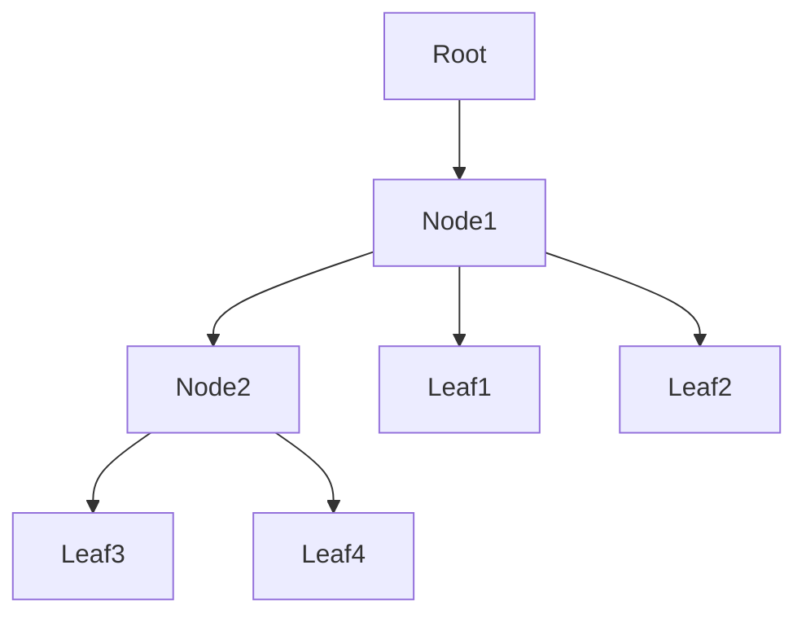

# B-Tree Index

Most relational databases use B-Tree structures for indexing.

```mermaid
flowchart TD

Root

--> Node1

--> Node2

Node1 --> Leaf1
Node1 --> Leaf2

Node2 --> Leaf3
Node2 --> Leaf4
```
