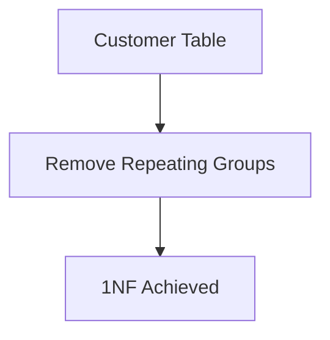

# First Normal Form (1NF)

Each column should contain atomic values and each row should be unique.

```mermaid
flowchart TD

A["Customer Table"]
--> B["Remove Repeating Groups"]
--> C["1NF Achieved"]
```
